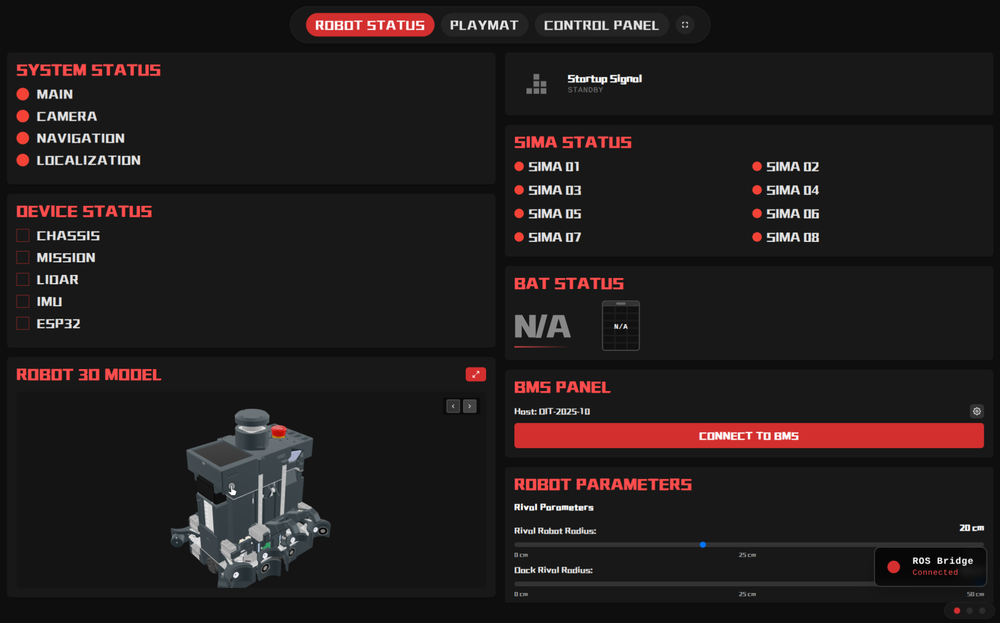
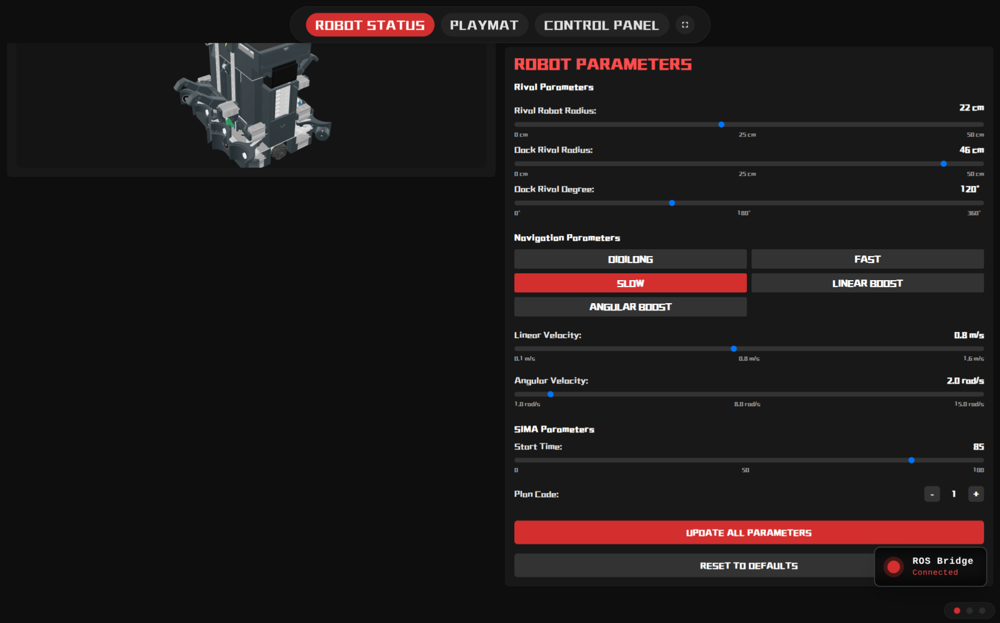
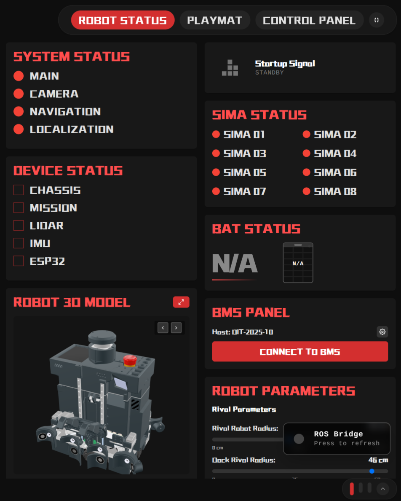
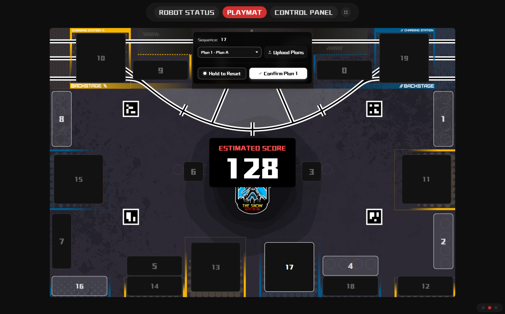
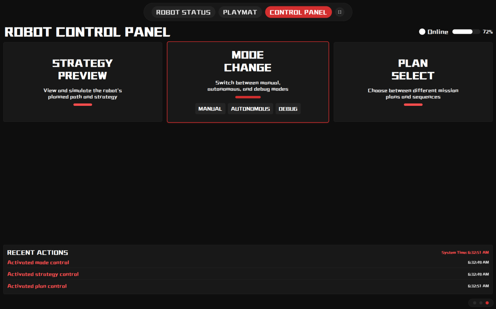

# Eurobot 2025 Robot Web UI

A comprehensive real-time web interface for monitoring and controlling Eurobot 2025 robots. This modern React-based dashboard provides intuitive visualization tools, real-time system monitoring, strategy planning, and robot control capabilities through ROS2 integration. The web-based architecture ensures universal compatibility across robot displays, iPads, laptops, and desktop computers, enabling flexible deployment and enhanced human-machine interaction during development and competition.

## Project Overview

This web UI serves as the central command center for Eurobot 2025 robots, offering:

- **Real-time robot monitoring** with live ROS2 data feeds
- **Interactive 3D robot model viewer** with multiple model variants
- **Strategic playmat visualization** with interactive game element planning
- **Comprehensive system status dashboard** with device connectivity tracking
- **Robot control panel** with strategy simulation and parameter adjustment
- **Multi-screen responsive design** optimized for competition environments

## Key Features

### ROBOT STATUS
- **System group status monitoring** (Main, Camera, Navigation, Localization)
- **Device connectivity status** (chassis, mission, LiDAR, IMU, ESP32)
- **Robot startup plug signal detection**
- **SIMA monitoring** with connectivity indicators
- **Battery voltage tracking** with visual indicators and alerts
- **Parameter management** for navigation, rival detection, and strategy settings

### PLAYMAT
- **Game field visualization** with official Eurobot 2025 playmat
- **Interactive strategy planning** with clickable game elements
- **Real-time score calculation** and strategy optimization
- **Plan sequence management** with save/load functionality

### CONTROL PANEL
- **Strategy preview and simulation** with path visualization [TODO]
- **Robot status monitoring** (online/standby/offline) [TODO]
- **Action history logging** with timestamps

### 3D Model Viewer
- **Interactive 3D robot models** with camera controls
- **Multiple model variants** with easy switching
- **Auto-rotation and zoom controls** for detailed inspection
- **Full-screen viewer** with dedicated interface
- **WebGL-based rendering** with optimized performance

## Technical Architecture

### Frontend Stack
- **React 19** with TypeScript for type-safe development and enhanced component architecture
- **Vite** for lightning-fast development server and optimized production builds
- **Tailwind CSS 4** with modern utility-first styling and custom design tokens
- **Model Viewer Web Component** for interactive 3D robot model rendering with WebGL optimization
- **Three.js** (available for advanced 3D development)
- **Lucide React & React Icons** for consistent iconography and visual elements

### 3D Visualization Technology
- **Model Viewer**: Web component implementation using `model-viewer.min.js` for GLB model rendering
- **3D Model Management**: Multiple robot model variants with seamless switching. To add/replace models, place your `.glb` files in `/public/assets/` and update the model list in `/public/model-viewer.html`

### ROS2 Real-Time Communication
- **roslib.js Integration**: WebSocket-based communication with ROS2 bridge at `ws://localhost:9090`
- **Shared Connection Management**: Singleton pattern in `useRosConnection.ts` for efficient resource usage
- **Auto-Reconnection**: Intelligent reconnection with exponential backoff (max 10 attempts)
- **Topic Subscription System**: Type-safe topic handlers with automatic cleanup

#### Active ROS2 Topics
**System Monitoring:**
- `/robot_status/battery_voltage` (Float32) - Real-time battery voltage monitoring
- `/robot_status/usb/chassis` (Bool) - Chassis STM32 microcontroller connectivity
- `/robot_status/usb/mission` (Bool) - Mission STM32 microcontroller connectivity
- `/robot_status/usb/lidar` (Bool) - LiDAR sensor connectivity
- `/robot_status/usb/esp` (Bool) - ESP32 microcontroller connectivity
- `/robot_status/usb/imu` (Bool) - IMU sensor connectivity

**Robot State:**
- `/robot/startup/plug` (Bool) - Robot ready signal
- `/robot/startup/groups_state` (Int32MultiArray) - System group status [MAIN, CAMERA, NAVIGATION, LOCALIZATION]
- `/robot/startup/ideal_score` (Int32) - Fallback score calculation from the main program

**Strategy & Scoring:**
- `/score` (Int32) - Primary real-time score updates from vision center

### Backend Integration
- **Express.js API Server**: RESTful endpoints for configuration management and parameter updates
- **YAML Configuration Management**: Dynamic robot parameter handling with `js-yaml` library and automatic file initialization
- **WebSocket Connections**: Persistent connections for live ROS2 data streaming via roslib.js
- **File-based Storage**: Persistent configuration in `/home/share/data/` with automatic default file creation
- **SIMA Device Network**: Multi-device connectivity monitoring with health checks to local network devices
- **API Endpoints**: RESTful routes for rival radius, navigation parameters, button states, and SIMA configuration

### Configuration Management
**Auto-Generated YAML Files:**
- `rival_params.yaml` - Rival robot detection parameters and dock configuration
  - `nav_rival_parameters.rival_inscribed_radius` (default: 0.22m)
  - `dock_rival_parameters.dock_rival_radius` (default: 0.46m)
  - `dock_rival_parameters.dock_rival_degree` (default: 120°)

**Navigation Profile YAML Files:**
- `nav_slow_params.yaml` - Conservative movement (linear: 0.8 m/s, angular: 2.0 rad/s)
- `nav_fast_params.yaml` - Aggressive movement (linear: 1.1 m/s, angular: 12.0 rad/s)
- `nav_linearBoost_params.yaml` - Linear speed optimized (linear: 1.1 m/s, angular: 2.0 rad/s)
- `nav_angularBoost_params.yaml` - Angular speed optimized (linear: 0.5 m/s, angular: 12.0 rad/s)
- `nav_didilong_params.yaml` - Balanced profile (linear: 1.5 m/s, angular: 1.0 rad/s)

**JSON Configuration Files:**
- `sima.json` - SIMA device timing and plan configuration
  - `sima_start_time` (default: 85 seconds)
  - `plan_code` (default: 1)
- `button.json` - Playmat interaction states and strategy sequences

### Development Tools
- **TypeScript** for enhanced code quality, IntelliSense, and type safety
- **ESLint** with React hooks plugin for code linting and consistency
- **Bun** for ultra-fast package management and builds
- **Docker Multi-stage Builds**: Optimized production containers with Nginx and supervisor
- **Hot Reloading**: Development environment with volume mounting and file watching

## Quick Start

### Prerequisites
- [Docker](https://docs.docker.com/get-docker/)
- [Docker Compose](https://docs.docker.com/compose/install/)

### Setup

1. **Clone the repository**
   ```bash
   git clone https://github.com/DIT-ROBOTICS/Eurobot-2025-Web.git
   cd Eurobot-2025-Web
   ```

2. **Start development environment**
   ```bash
   docker compose -f docker-compose.dev.yml up -d
   ```

The development interface will be available at http://localhost:5173

## Docker Deployment

### Development Environment
For development with hot-reloading and debugging:

```bash
# Start development containers
docker-compose -f docker-compose.dev.yml up -d

# View logs
docker-compose -f docker-compose.dev.yml logs -f app-dev

# Stop development environment
docker-compose -f docker-compose.dev.yml down
```

**Development server:** http://localhost:5173

### Production Environment
For optimized production deployment:

```bash
# Build and start production containers
docker-compose up -d --build

# View logs
docker-compose logs -f app

# Stop production environment
docker-compose down
```

**Production server:** http://localhost:3000

### Docker Architecture
- **Dockerfile.dev**: Development environment with Bun, hot-reloading, and WebGL system dependencies
- **Dockerfile**: Multi-stage production build with Nginx reverse proxy and supervisor process management
- **docker-compose.dev.yml**: Development orchestration with volume mounting and host networking
- **docker-compose.yml**: Production orchestration with health checks and data persistence
- **nginx.conf**: Production web server configuration with API proxying

## Configuration

### ROS2 Integration
The application connects to ROS2 bridge at `ws://localhost:9090`. Configure your ROS2 environment:

```bash
# Install ros2-web-bridge
sudo apt install ros-<distro>-rosbridge-server

# Start the bridge
ros2 launch rosbridge_server rosbridge_websocket_launch.xml
```

### Environment Variables
- `NODE_ENV`: Set to `production` for production builds
- `API_SERVER_PORT`: API server port (default: 3001)

### Data Persistence
Configuration files are stored in `/home/share/data/`:
- `rival_params.yaml`: Rival robot detection parameters
- `nav_*_params.yaml`: Navigation parameter profiles
- `sima.json`: SIMA device configuration
- `button_states.json`: Playmat interaction states

## Screenshots






